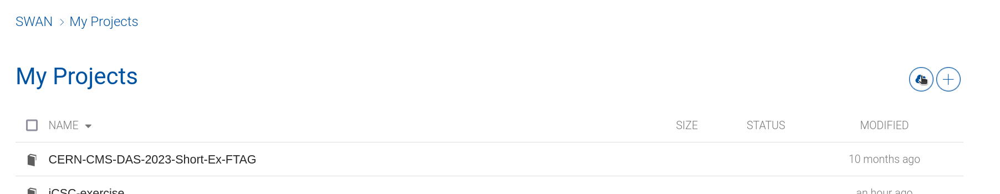

The following repository contains the code for running the exercise for [my inverted CERN School of Computing lecture](https://indico.cern.ch/event/1334738/contributions/5814283/) on Generative Models for HEP.

If you are not attending in person to the exercise, please leave SWAN machines to the in-person attendees and deploy the notebook on Colab, as SWAN machines are limited in number.

## Swan Instructions

1. Having a CERNBox account is a requirement to use SWAN. To activate yours connect to https://cernbox.cern.ch

2. Connect to: https://swan.cern.ch

3. Deploy a machine with the software stack 105a Cuda (GPU), leaving all others parameters as default and clicking on "Start my session"

4. Click on the Cloud icon (Download from Git)

5. Paste the repo url https://github.com/francesco-vaselli/iCSC-exercise.git and click download

6. Click on the exercise.ipynb and follow the notebook!

